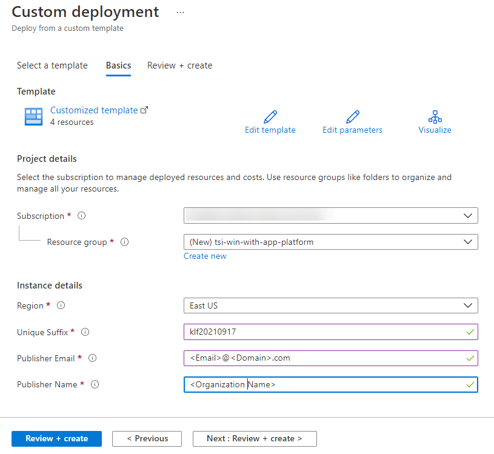

<h1>Win with App Innovation -- Humongous Healthcare Proof of Concept</h1>

<h2>Before the hands-on lab</h2>

September 2022

**Table of contents**

- [Before the hands-on lab setup guide](#before-the-hands-on-lab-setup-guide)
  - [Requirements](#requirements)
  - [Before the hands-on lab](#before-the-hands-on-lab)
    - [Task 1: Create an Azure resource group using the Azure Portal](#task-1-create-an-azure-resource-group-using-the-azure-portal)
    - [Task 2: Deploy Azure resources](#task-2-deploy-azure-resources)
    - [Task 4: Fork the GitHub repository](#task-4-fork-the-github-repository)

# Before the hands-on lab setup guide

## Requirements

1. Microsoft Azure subscription must be pay-as-you-go or MSDN.

    - Trial subscriptions will not work.

2. Install [Visual Studio Code](https://code.visualstudio.com/).

    - Install the [C# for Visual Studio Code extension](https://marketplace.visualstudio.com/items?itemName=ms-dotnettools.csharp).

3. Install the latest version of [the .NET 6 SDK](https://dotnet.microsoft.com/en-us/download/dotnet/6.0).

4. Install [Docker Desktop](https://docs.docker.com/desktop/)
5. Install the [Kubernetes CLI](https://kubernetes.io/docs/tasks/tools/)

## Before the hands-on lab

Duration: 15 minutes

In this exercise, you will set up your environment for use in the rest of the hands-on lab. You should follow all steps provided before attending the Hands-on lab.

### Task 1: Create an Azure resource group using the Azure Portal

In this task, you will use the Azure Portal to create a new Azure Resource Group for this lab.

1. Log into the [Azure Portal](https://portal.azure.com).

2. On the top-left corner of the portal, select the menu icon to display the menu.

    

3. In the left-hand menu, select **Resource Groups**.

4. At the top of the screen select the **+ Create** option to add a new resource group.

   

5. Create a new resource group with the name **taw-win-with-app-platform**, ensuring that the proper subscription and region nearest you are selected. Once you have chosen a location, select **Review + Create**.

   

6. On the Summary blade, select **Create** to provision your resource group.

### Task 2: Deploy Azure resources

The below ARM template deploys several Azure resources for the labs, including Azure Cosmos DB, App Services, and API Management.

1. Deploy the workspace through the following Azure ARM template (select the button below):

    

2. On the **Custom deployment** form fill in the fields described below.

   - **Subscription**: Select your desired subscription for the deployment.
   - **Resource group**: Select the resource group you previously created, `taw-win-with-app-platform`.
   - **Region**: The region where your Azure resources will be created.  All resources will be created in your resource group's region.
   - **Unique Suffix**: This unique suffix will be used naming resources that will created as part of your deployment, such as your initials followed by the current year and month in YYYYMM format (ex. `jdh202106`). Make sure you follow correct Azure [Resource naming](https://docs.microsoft.com/en-us/azure/cloud-adoption-framework/ready/azure-best-practices/naming-and-tagging#resource-naming) conventions.
   - **Publisher Email**:  Enter your e-mail address.  API Management uses this as part of its publisher properties.
   - **Publisher Name**:  Enter your organization's name.  API Management uses this asp art of its publisher properties.

   

3. Select the **Review + create** button, then **Create**. The provisioning of your deployment resources will take several minutes.  Because you will use the Consumption tier of API Management, provisioning will be considerably faster but you will not be able to create certain types of policies.

### Task 4: Fork the GitHub repository

1. Fork this repository and make a copy on your own GitHub account.  You will use your version of this repository as the starting point for the hands-on lab.

    

You should follow all steps provided *before* performing the hands-on lab.
