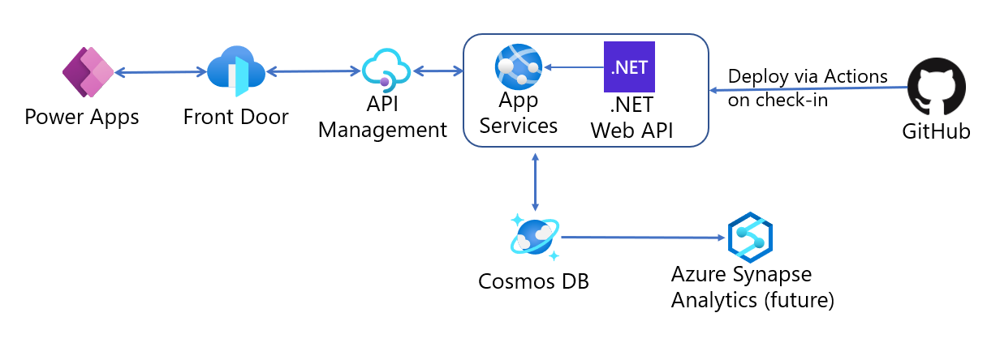
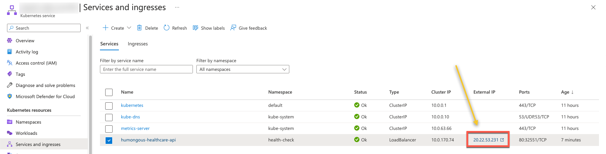
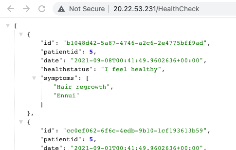
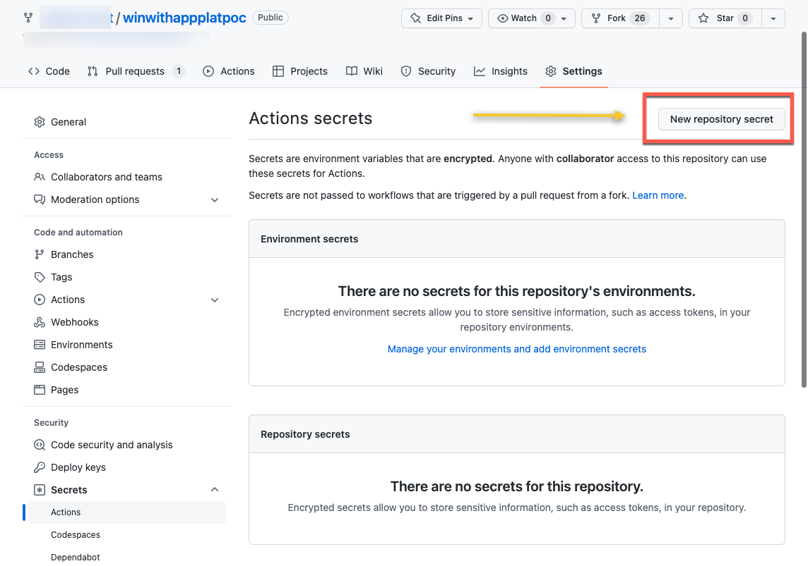

<h1>Win with App Platform -- Humongous Healthcare Proof of Concept</h1>

<h2>Hands-on lab</h2>

September 2022

**Table of contents**

- [Hands-on Lab Step-by-Step](#hands-on-lab-step-by-step)
  - [Abstract and learning objectives](#abstract-and-learning-objectives)
  - [Overview](#overview)
  - [Solution architecture](#solution-architecture)
  - [Requirements](#requirements)
  - [Before the hands-on lab](#before-the-hands-on-lab)
  - [Exercise 1:  Finish configuring Azure services and retrieve values](#exercise-1--finish-configuring-azure-services-and-retrieve-values)
    - [Task 1: Create Cosmos DB container](#task-1-create-cosmos-db-container)
  - [Exercise 2:  Review and publish the Humongous Healthcare Web API service](#exercise-2--review-and-publish-the-humongous-healthcare-web-api-service)
    - [Task 1:  Review the Humongous Healthcare Web API service](#task-1--review-the-humongous-healthcare-web-api-service)
    - [Task 2: Run the Humongos Healthcare Web API service in a container](#task-2-run-the-humongos-healthcare-web-api-service-in-a-container)
    - [Task 3: Push the Humongous Healthcare Web API container image to ACR](#task-3-push-the-humongous-healthcare-web-api-container-image-to-acr)
    - [Task 4: Deploy the Humongous Healthcare Web API service to AKS](#task-4-deploy-the-humongous-healthcare-web-api-service-to-aks)
  - [Exercise 3:  Configure AKS continuous deployment with GitHub Actions](#exercise-3--configure-aks-continuous-deployment-with-github-actions)
    - [Task 1:  Create a GitHub Actions Workflow](#task-1--create-a-github-actions-workflow)
  - [Exercise 4:  Configure API Management](#exercise-4--configure-api-management)
    - [Task 1:  Review the Health Checks API](#task-1--review-the-health-checks-api)
    - [Task 2:  Connect API Management to the App Service](#task-2--connect-api-management-to-the-app-service)
  - [Exercise 5: Deploy the Humongous Healthcare Web Application to access the Web API](#exercise-5-deploy-the-humongous-healthcare-web-application-to-access-the-web-api)
    - [Task 1: Configure API Management to use HTTPS](#task-1-configure-api-management-to-use-https)
    - [Task 2: Configure CORS](#task-2-configure-cors)
    - [Task 3: Deploy the Humongous Healthcare Web API service to App Services](#task-3-deploy-the-humongous-healthcare-web-api-service-to-app-services)

# Hands-on Lab Step-by-Step

## Abstract and learning objectives

In this hands-on-lab, you will build a proof of concept for an Application Innovation solution, combining several Azure services and technologies together to solve a customer problem.  In this lab, you will deploy a .NET 6 Web API application to Azure Kubernetes Service and perform continuous integration and continuous deployment with GitHub Actions.  Then, you will use the API Management service to "protect" Web API and allow for centralized API versioning and management.  Then, you will deploy a React frontend to App Services and use it to access your API endpoints through API Management.

## Overview

**Humongous Healthcare** is a global network of healthcare providers with presence throughout the industry.  Humongous Healthcare wishes to drive a new Health Checks initiative, which specifically entails building a suite of health check applications for end users.  These applications will allow users to submit information on their current health status and submit a questionnaire concerning any medical symptoms they might have experienced over the past 14 days.

Humongous already uses a variety of Microsoft Azure services, taking advantage of both Infrastructure-as-a-Service and Platform-as-a-Service offerings.  Their software engineers and infrastructure team have a good working familiarity with Azure services and wish to use this opportunity to develop an innovative product which can serve as a guide for future modernization of their existing applications and infrastructure.

The Engineering team at Humongous Healthcare is looking for a modern, innovative application platform, but this is not the only key group which will be involved.  Business Analysts will be responsible for creating the business logic and user experience for most of the Health Checks applications (with the assistance of an outside consulting group).  The consulting group will not be required to deploy to AKS and have indicated that they prefer to work with App Services.  These applications should be able to access API endpoints which the Engineering team plan to build.

Humongous would like to manage one API for accessing the back end of all of these health applications.  In practice, Humongous expects something on the order of 15-20 endpoints to support the breadth of their health check application suite, but for the purposes of a proof of concept, they would like to see two endpoints implemented: one which submits information on current health status and one which retrieves submissions for the registered user.  The key data points Humongous would like to see in this proof of concept are as follows:

- Submission ID, generated by the system
- Patient ID, handled as part of a future authentication process.  For the proof of concept, it would be okay for the end application to hard-code the patient ID
- Date and time of submission
- Current health status (one of "I feel well" or "I feel unwell")
- A list of symptoms over the past 14 days, where each symptom is a free-form text entry with no validation

Humongous's Engineering team also wish to have all data stored in a single database, as this will simplify security and open up opportunities for their data scientists to analyze the data most efficiently.  In addition, they would like to centralize management of any access points to the data.  Different Engineering teams will work on separate API endpoints and they are interested in anything which can improve the coordination between teams.  As far as data storage is concerned, the architects would like to see flexible data structures.  The reason for this is that individual providers in their network often have differing requirements on what data they collect, depending on their specialization.  The questionnaires which end users fill out will likely differ based on facility, mode of treatment, nation, and region.  They may also change over time to support additional testing options, such as asking end users a subset of the questions sometimes or adding and removing questions from the survey applications.

For this proof of concept, Humongous would also like to see a model example of Continuous Integration and Continuous Deployment (CI/CD) pipelines for code development and deployment.

## Solution architecture

The following diagram provides a high-level overview of the Azure services we will use for implementation.



API Management will allow Humongous Healthcare to centralize and manage information on a variety of API endpoints.  These API endpoints may be implemented using a variety of Azure services, but the one which makes the most intuitive sense is Azure Kubernetes Service because the engineering team eventual plans to orchestrate a large number of APIs.

To store and retrieve data, the endpoints will use Cosmos DB for data storage.  This satisfies customer requests for a flexible schema and includes a rich .NET interface.  Furthermore, via Cosmos Link, we can include an automated process to make data available in Azure Synapse Analytics dedicated SQL pools or Spark pools.  This allows Humongous Healthcare data scientists to analyze data across a variety of end users over time without building extensive ELT pipelines or processes.  Because this would be a "phase two" operation, it deserves mention in an architectural diagram but will not be part of the proof of concept.

For this solution, we used GitHub for source control and continuous integration/continuous deployment tasks.  Azure DevOps is another viable alternative.  After checking code in, a GitHub Action will deploy the .NET Web API code to an existing App Service, making changes and deployment straightforward.  This also provides the opportunity to perform unit and integration testing against code before deploying the code, although that is out of scope of the proof of concept.

Azure Front Door is a layer 7 load balancer which includes web application firewall (WAF) capabilities.  This allows Humongous to implement the [Gatekeeper architecture pattern](https://docs.microsoft.com/en-us/azure/architecture/patterns/gatekeeper) and secure their APIs against malicious traffic, including IP addresses from known bot networks.  Humongous can use Azure-managed rule sets, as well as creating custom rule sets to monitor, redirect, or block traffic as configured.

> **Note**:  This proof of concept will not include the Azure Front Door or Synapse Analytics services.

## Requirements

1. Microsoft Azure subscription must be pay-as-you-go or MSDN.

    - Trial subscriptions will not work.

2. Install [Visual Studio Code](https://code.visualstudio.com/).

    - Install the [C# for Visual Studio Code extension](https://marketplace.visualstudio.com/items?itemName=ms-dotnettools.csharp).
    - Install the [Azure App Service for Visual Studio Code extension](https://marketplace.visualstudio.com/items?itemName=ms-azuretools.vscode-azureappservice).

3. Install the latest version of [the .NET 6 SDK](https://dotnet.microsoft.com/en-us/download/dotnet/6.0).

4. Install the latest version of the [Postman](https://www.postman.com/) client.
5. Install [Docker Desktop](https://docs.docker.com/desktop/)
6. Install the [Kubernetes CLI](https://kubernetes.io/docs/tasks/tools/)

## Before the hands-on lab

Refer to the [Before the hands-on lab setup guide](Before%20the%20Hands-On%20Lab.md) before continuing to the lab exercises.

## Exercise 1:  Finish configuring Azure services and retrieve values

### Task 1: Create Cosmos DB container

1. In the **Overview** section for your Cosmos DB account, select **Add Container**.

    

3. In the **New Container** tab, complete the following:

   | Field                              | Value                                           |
   | ---------------------------------- | ----------------------------------------------- |
   | Database id                        | _select `Create new` and enter `HealthCheckDB`_ |
   | Share throughput across containers | _select the checkbox_                           |
   | Throughput                         | _select `Manual`_                               |
   | Number of R/Us                     | _enter `400`_                                   |
   | Container id                       | _`HealthCheck`_                                 |
   | Partition key                      | _`/id`_                                         |

   

4. Select **OK** to create the container. This will take you to the Data Explorer pane for Cosmos DB.

## Exercise 2:  Review and publish the Humongous Healthcare Web API service

### Task 1:  Review the Humongous Healthcare Web API service

1. Open the hands-on lab in Visual Studio Code and use the terminal to navigate to the `Humongous.Healthcare` project.

2. Run the following commands in the terminal to restore and build the project, bringing in necessary packages.

    ```sh
    dotnet restore
    dotnet build
    ```

3. Review the `HealthCheckController.cs` controller to see the available endpoints.  There are two endpoints included in this controller:  `HealthCheck` and `HealthCheck/GetStatus`.  The `HealthCheck` endpoint accepts four REST API verbs:  `GET`, `PUT`, `POST`, and `DELETE`.  Furthermore, data retrieval using `GET` will either list health checks (when passing in zero parameters) or retrieve details on a single health check (passing in one parameter).  For this proof of concept, we do not implement logic to control results by patient ID but the code base could be extended to incorporate this.  The `GetStatus` method serves as a quick test method, ensuring that the service is up by returning data.

4. Review the `Startup.cs` file, particularly the `ConfigureServices()` and `Configure()` methods.  Because this project uses the `Swashbuckle.AspNetCore` NuGet package, we can build a Swagger API and user interface automatically from our Web API definition.  This will be important later on when integrating with API Management.

5. Open the `appsettings.json` file and replace the `Account` and `Key` with your Cosmos DB URI and primary key, respectively.

6. Try this project locally and ensure that it works as expected.  To do this, execute the following in the terminal:

    ```sh
    dotnet run
    ```

    

7. Use the Postman application to call the `HealthCheck/GetStatus` endpoint.  This should return one record.

    

8. Use the Postman application to post three status updates, one call at a time.  Use the following JSON blocks to execute `POST` operations against the `HealthCheck` endpoint.  Be sure to set the Body format to JSON.  You should get back a **201 Created** response with a copy of each created record.

    ```json
    {
        "patientid": 5,
        "date": "2021-09-01T00:41:49.9602636+00:00",
        "healthstatus": "I feel healthy",
        "symptoms": [
            "None"
        ]
    }
    ```

    ```json
    {
        "patientid": 5,
        "date": "2021-09-04T00:41:49.9602636+00:00",
        "healthstatus": "I feel unwell",
        "symptoms": [
            "Hair loss",
            "Internal bleeding",
            "Temporary blindness"
        ]
    }
    ```

    ```json
    {
        "patientid": 5,
        "date": "2021-09-08T00:41:49.9602636+00:00",
        "healthstatus": "I feel healthy",
        "symptoms": [
            "Hair regrowth",
            "Ennui"
        ]
    }
    ```

    

9. Use the `GET` verb on the `HealthCheck` endpoint to retrieve an array containing health check records.

    

10. When you are done, use `Ctrl+C` to stop the dotnet service.

### Task 2: Run the Humongos Healthcare Web API service in a container

1. Open the hands-on lab in Visual Studio Code and use the terminal to navigate to the `Humongous.Healthcare` project.

2. Create a file named `Dockerfile` and add the following contents.

    ```dockerfile
    FROM mcr.microsoft.com/dotnet/sdk:6.0 AS build-env
    WORKDIR /app

    # Copy project file
    COPY ./Humongous.Healthcare.csproj .
    # Restore as distinct layer
    RUN dotnet restore

    # Copy everything else
    COPY . .

    # Build and publish a release
    RUN dotnet publish -c Release -o out

    # Build runtime image
    FROM mcr.microsoft.com/dotnet/aspnet:6.0
    WORKDIR /app
    COPY --from=build-env /app/out .
    ENTRYPOINT ["dotnet", "Humongous.Healthcare.dll"]
    ```

    This is a multi-stage Dockerfile with 2 stages, build and runtime.  The build stage uses the .net 6 SDK image which contains all the compilers and tooling needed to create the Web API service. In contrast, the runtime stage is based on the smaller `aspnet` image, which only contains the necesssary binaries to execute asp.net applications.

    The build stage:
    - Copies the project file into the Docker container and runs `dotnet restore` to retrieve nuget packages.  This is a stand-alone layer so that the packages will be cached if we need to run `docker build` again.
    - Copies the remaining project files to the container then runs `dotnet publish` to create the Web API service.

    The runtime stage starts from a clean `aspnet` image without compiler tooling or intermediate object files then:
    - Copies the Web API binaries from the build stage.
    - Configures the container image to run the Web API on startup.

3. Run the following command to build the container image.

    ```sh
    docker build -t api .
    ```

4. Run the following command to run an instance of the container image.

    ```sh
    docker run -it -p 5000:80 api
    ```

5. Use postman (or your browser) to `GET` the following URL and confirm the Web API is functioning inside the container.

    `http://localhost:5000/HealthCheck`

6. When you are done, use `Ctrl+C` to stop the container instance.

### Task 3: Push the Humongous Healthcare Web API container image to ACR

1. Use the following command to tag your container image with your ACR login server name and a more descriptive repository name:

    ```sh
    docker tag api <replace with your login server>/humongous-healthcare-api:0.0.0
    ```

    Example:

    ```sh
    docker tag api taw.azurecr.io/humongous-healthcare-api:0.0.0
    ```

2. Login to the Azure CLI and the ACR instance using the following commands:

    ```sh
    az login
    az acr login --name <acrName>
    ```

    Example
    ```sh
    az login
    az acr login --name taw
    ```

3. Use the following command to push the container image to ACR.

    ```sh
    docker push <replace with your login server>/humongous-healthcare-api:0.0.0
    ```

    Example:

    ```sh
    docker push taw.azurecr.io/humongous-healthcare-api:0.0.0
    ```

### Task 4: Deploy the Humongous Healthcare Web API service to AKS

1. Open the hands-on lab in Visual Studio Code.

2. Create a folder named `manifests` and add a file named `deployment.yml` with the following content:

    ```yaml
    apiVersion: apps/v1
    kind: Deployment
    metadata:
      name: "humongous-healthcare-api"
    spec:
      replicas: 3
      selector:
        matchLabels:
          app: "humongous-healthcare-api"
      template:
        metadata:
          labels:
            app: "humongous-healthcare-api"
        spec:
          containers:
          - name: "humongous-healthcare-api"
            image: "<replace with your login server>/humongous-healthcare-api:0.0.0"
            env:
            - name: CosmosDb__Account
              valueFrom:
                secretKeyRef:
                  name: cosmosdb
                  key: cosmosdb-account
                  optional: false
            - name: CosmosDb__Key
              valueFrom:
                secretKeyRef:
                  name: cosmosdb
                  key: cosmosdb-key
                  optional: false
            - name: CosmosDb__DatabaseName
              value: HealthCheckDB
            - name: CosmosDb__ContainerName
              value: HealthCheck
            imagePullPolicy: IfNotPresent
            ports:
              - name: http
                containerPort: 80
                protocol: TCP
            livenessProbe:
              httpGet:
                path: /HealthCheck
                port: http
            readinessProbe:
              httpGet:
                path: /HealthCheck
                port: http
            resources:
              limits:
                cpu: 200m
                memory: 256Mi
              requests:
                cpu: 200m
                memory: 256Mi
    ```

    This manifest contains the AKS deployment configuration for the Humongous Healthcare Web API container images.  Be sure to update `<replace with your login server>` with your ACR login server name.

3. Create another YAML file in the `manifest` folder called `service.yml` and add the following content:

    ```yaml
    apiVersion: v1
    kind: Service
    metadata:
      name: "humongous-healthcare-api"
      labels:
        app: "humongous-healthcare-api"
    spec:
      type: LoadBalancer
      ports:
      - port: 80
        targetPort: 80
        protocol: TCP
        name: http
      selector:
        app: "humongous-healthcare-api"
    ```

    This manifest contains the AKS service configuration for the Humongous Healthcare Web API deployment.  Because it is a `LoadBalancer` type service, AKS will make the Web API service available to clients outside the cluster.

4. Login to your AKS cluster using the Azure CLI command shown below.

    ```sh
    az aks get-credentials --name <your cluster name> --resource-group <your resource group>
    ```

    Example

    ```
    az aks get-credentials --name taw-aks --resource-group taw
    ```

5. Create a Kubernetes namespace for the service using the following command.

    ```sh
    kubectl create namespace health-check
    ```

6. Create a Kubernetes secret to provide the CosmosDB configuration using the following command.

   ```sh
   kubectl create secret generic cosmosdb --namespace health-check --from-literal=cosmosdb-account='<Replace with your account URL>' --from-literal=cosmosdb-key='<Replace with your account key>'
   ```

    Example:

   ```sh
   kubectl create secret generic cosmosdb --namespace health-check --from-literal=cosmosdb-account='https://taw-cosmosdb.documents.azure.com:443/' --from-literal=cosmosdb-key='qwerty123456!@#$%==='
   ```

7. Create the AKS deployment and service using the following commands.

    ```sh
    kubectl apply --namespace health-check --filename manifests/deployment.yml --filename manifests/service.yml
    ```

8. Visit your AKS cluster in the Azure Portal and navigate to "Kubernetes resources > Services and ingresses".  Click the "External IP" link for `humonguous-healthcare-api`.  **Note**: You will initially recieve a 404 error when the new brower tab opens.  Continue to the next step.

    

9. Add the `/HealthCheck` IP to the end of the URL to view the raw health check data.

    

7. Once this deployment succeeds, you should be able to navigate to your External IP address in Postman and perform the same `GET`, `POST`, `PUT`, and `DELETE` operations you could locally.

## Exercise 3:  Configure AKS continuous deployment with GitHub Actions

### Task 1:  Create a GitHub Actions Workflow

1. Open the hands-on lab in Visual Studio Code.

2. Create a folder named `.github/workflows` and add a file named `deployToAksCluster.yml` with the following content (remember to replace the placeholders with your ACR name where noted below):

    ```yaml
    name: API - AKS - Build and deploy

    on:
    push:
      branches:
      - main
      paths:
      - Humongous.Healthcare/**
      - manifests/**

    jobs:
      build-and-deploy:
        runs-on: ubuntu-latest
        env:
          ACR_LOGIN_SERVER: <replace with your ACR name>.azurecr.io
          AKS_NAMESPACE: health-check
          CONTAINER_IMAGE: <replace with your ACR name>.azurecr.io/humongous-healthcare-api:${{ github.sha }}
        steps:
        - uses: actions/checkout@master

        - uses: azure/docker-login@v1
          with:
            login-server: ${{ env.ACR_LOGIN_SERVER }}
            username: ${{ secrets.acr_username }}
            password: ${{ secrets.acr_password }}

        - name: Build and push image to ACR
          id: build-image
          run: |
            docker build "$GITHUB_WORKSPACE/Humongous.Healthcare" -f  "Humongous.Healthcare/Dockerfile" -t ${CONTAINER_IMAGE} --label dockerfile-path=Humongous.Healthcare/Dockerfile
            docker push ${CONTAINER_IMAGE}

        - uses: azure/k8s-set-context@v1
          id: login
          with:
            kubeconfig: ${{ secrets.aks_kubeConfig }}

        - name: Create namespace
          run: |
            namespacePresent=`kubectl get namespace | grep ${AKS_NAMESPACE} | wc -l`
            if [ $namespacePresent -eq 0 ]
            then
                echo `kubectl create namespace ${AKS_NAMESPACE}`
            fi

        - uses: azure/k8s-create-secret@v1
          name: dockerauth - create secret
          with:
            namespace: ${{ env.AKS_NAMESPACE }}
            container-registry-url: ${{ env.ACR_LOGIN_SERVER }}
            container-registry-username: ${{ secrets.acr_username }}
            container-registry-password: ${{ secrets.acr_password }}
            secret-name: dockerauth

        - uses: Azure/k8s-create-secret@v1
          name: cosmosdb - create secret
          with:
            namespace: ${{ env.AKS_NAMESPACE }}
            secret-type: 'generic'
            secret-name: cosmosdb
            arguments:
              --from-literal=cosmosdb-account=${{ secrets.COSMOSDB_ACCOUNT }}
              --from-literal=cosmosdb-key=${{ secrets.COSMOSDB_KEY }}

        - uses: azure/k8s-deploy@v1.2
          with:
            namespace: ${{ env.AKS_NAMESPACE }}
            manifests: |
              manifests/deployment.yml
              manifests/service.yml
            images: |
              ${{ env.CONTAINER_IMAGE }}
            imagepullsecrets: |
              dockerauth
    ```

    > Note: An example of this YAML file can be located in the `./actions` folder of this lab as `deployToAksCluster.yml`.

3. The workflow will fail on the intial run because it requires some secrets to be setup in the repository.  Navigate to the repository in GitHub then select "Settings > Secrets > Actions".  Finally use the "New Repository Secret" button to create secrets.

    

    Create the following secrets.

    - ACR_USERNAME - Copy from the "Access Keys" pane on your container registry.
    - ACR_PASSWORD - Copy from the "Access Keys" pane on your container registry.
    - AKS_KUBECONFIG - Use the following Azure CLI command to retrieve the configuration data and save it to a file, then use the contents of the file as your secret: `az aks get-credentials --name <your cluster name> --resource-group <your resource group> --file kube.config`
    - COSMOSDB_ACCOUNT - Use the CosmosDb account URI you have previously retrieved during this lab.
    - COSMOSDB_KEY - Use the CosmosDb account key you have previously retrieved during this lab.

4. Once you create all the secrets, navigate to the "Actions" tab, select your failed workflow run, and choose "Re-run all Jobs".

5.  Once this deployment succeeds, you should still be able to navigate to your App Service URL in Postman and perform the same `GET`, `POST`, `PUT`, and `DELETE` operations you could locally.

## Exercise 4:  Configure API Management

### Task 1:  Review the Health Checks API

Because this project uses the `Swashbuckle.AspNetCore` NuGet package, we can build a Swagger API and user interface automatically from our Web API definition.  The `ConfigureServices()` method in **Startup.cs** automatically configures a [Swagger OpenAPI interface](https://swagger.io/specification/).

1. Navigate to http://{external-ip}/swagger/v1/swagger.json, replacing `{external-ip}` with the external IP address of your cluster.  This will take you to a JSON schema describing the Health Check API.

    

2. Navigate to http://{external-ip}/swagger/index.html, again replacing `{external-ip}` with the external IP address of your cluster.  This will take you to an auto-generated user interface describing each of the API endpoints.

    

### Task 2:  Connect API Management to the App Service

1. Open the API Management service in your `taw-win-with-app-platform` resource group.  Navigate to the **APIs** option in the **APIs** menu, choose **+ Add API**, and select **OpenAPI** in the **Create from definition** section.

    > **Note:**  There is an option in the **Define a new API** menu for defining an App Service API, and there is a way to connect an App Service directly to API Management, but these two methods will require manual editing of the Swagger file to work.  This method will automatically pick up all available endpoints without adding spurious `TRACE` or `HEAD` verbs.

    

2. Create a new API from an OpenAPI specification by entering the following details.  Then select **Create** to generate a new API.

    | Parameter             | Value                      |
    | --------------------- | -------------------------- |
    | OpenAPI specification | Enter the swagger.json URL |
    | Display name          | Enter `HealthChecks`       |
    | Name                  | Enter `healthchecks`       |
    | API URL suffix        | Leave blank                |

    

3. After creating this API, you should now see the same endpoints that you observed in Task 1.  Select the **Settings** menu option to continue to the next step.

    

4. Select the **Test** menu and then choose the first `GET` method for health checks.  Select **Send** to perform a test.  You should receive back a response with "200 OK" indicating that the request was successful.

    

    > **Note:**  If you receive a 500 error, make sure that you configured the web service URL in the prior step.

5. Humongous Healthcare would like to perform rate limiting as a method of limiting risk of Denial of Service attacks.  In order to enable rate limiting on an API, return to the **Design** menu and ensure that you have selected **HealthChecks** and **All operations**.  From there, select **+ Add policy** under **Inbound processing**.

    

6. On the inbound policy list, select the **Limit call rate** policy.

    

7. Humongous would like to ensure that a particular user does not send more than 10 calls over a 300-second period.  Enter those values into the appropriate fields and select **Save** to create this policy.

    

    > **Note:** If you are using the Consumption SKU of API Management, you will not be able to save this policy.  In that case, select **Discard** to cancel this operation.  You might also need to delete a **rate-limit-key** policy below the **base** policy in your **Inbound processing** section.  To do this, select the **...** menu and choose **Delete** to remove it.

## Exercise 5: Deploy the Humongous Healthcare Web Application to access the Web API

### Task 1: Configure API Management to use HTTPS

1. Open the API Management service in your `taw-win-with-app-platform` resource group.  Navigate to the **APIS** option in the **APIs** menu, and select the **HealthChecks** API that was created in a previous exercise from the **All APIs** menu.

    

2. Select the **Settings** tab, and select the **HTTPS** setting in the **General** section.  Click on the **Save** button at the bottom of the page to save the configuration.

    

### Task 2: Configure CORS

1. Open the App Service in your `taw-win-with-app-platform` resource group.  Copy the App Service endpoint URL from the **Overview** detail and save it for use in a later step.

    

2. Open the API Management service in your `taw-win-with-app-platform` resource group.  Navigate to the **APIs** option in the **APIs** menu, and select the **HealthChecks** API that was created in a previous exercise from the **All APIs** menu.

    

3. In the **Design** tab, navigate to the **+ Add policy** option in the **Inbound processing** section.

    > **Note:** Ensure that **All operations** is highlighted to ensure that the CORS policy you are about to add is applied to all of the API endpoints.

    

4. Select the **cors** inbound policy from the collection of policies.

    

5. Enter the App Service endpoint URL obtained in step 1 of this task into the **Allowed origins** field.  Click on the **Save** button at the bottom of the page to save the configuration.

    

### Task 3: Deploy the Humongous Healthcare Web API service to App Services

1. Open the App Service in your `taw-win-with-app-platform` resource group.  Navigate to the **Deployment Center** option in the **Deployment** menu.  Select **GitHub** from the **Source** drop-down field and enter the **Organization**, **Repository** and **Branch** of your GitHub repository into the corresponding fields.  Click the **Save** button to create the associated GitHub action to deploy the web app.

    

2. Add the necessary secrets to GitHub for the App Service deployment.  Navigate to the repository in GitHub and select "Settings > Secrets > Actions".  Use the "New Repository Secret" button to create secrets.

    

    Create the following secrets.

    - API_URL - This should be the HealthCheck API Endpoint URL
    - API_KEY - This should be the HealthCheck API Subscription API Key


3. Locate the GitHub action YAML file created in your repository by Step 1 located in the `.github/workflows` folder.  Make the following modifications to the contents to ensure the correct working directory and references to GitHub secrets.


    ```yaml
    ...

    env:                                            # <<-- Add environment variables here
      REACT_APP_API_URL: ${{ secrets.API_URL }}     # <<-- referencing the GitHub secrets
      REACT_APP_API_KEY: ${{ secrets.API_KEY }}     # <<-- created in Step 2
    jobs:
      build:
        runs-on: windows-latest

        defaults:                                             # <<-- Add default working directory
          run:                                                # <<-- here to ensure deployment 
            working-directory: ./Humongous.Healthcare.Web/    # <<-- targets correct path.
    ​
        steps:
        - uses: actions/checkout@v2
    ​
        - name: Set up .NET Core
          uses: actions/setup-dotnet@v1
          with:
            dotnet-version: '6.0.x'
            include-prerelease: true

    ...
    ```
